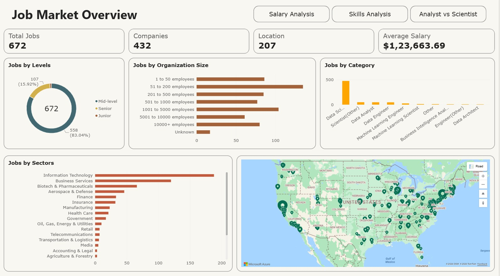
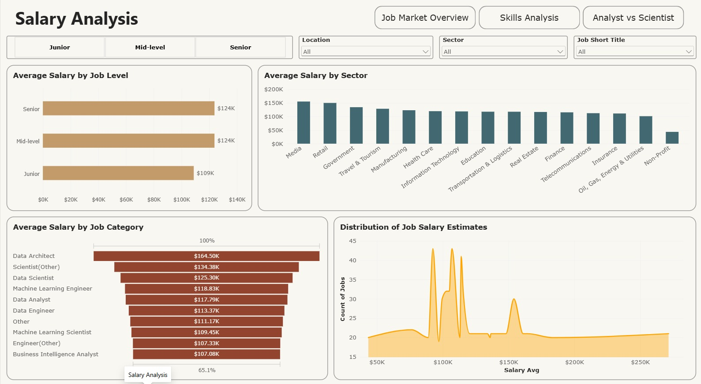
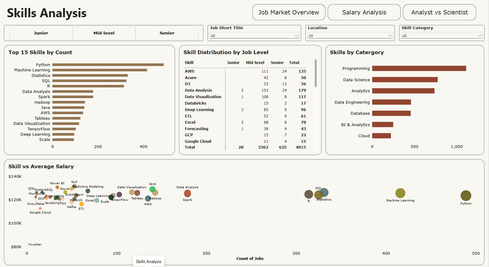
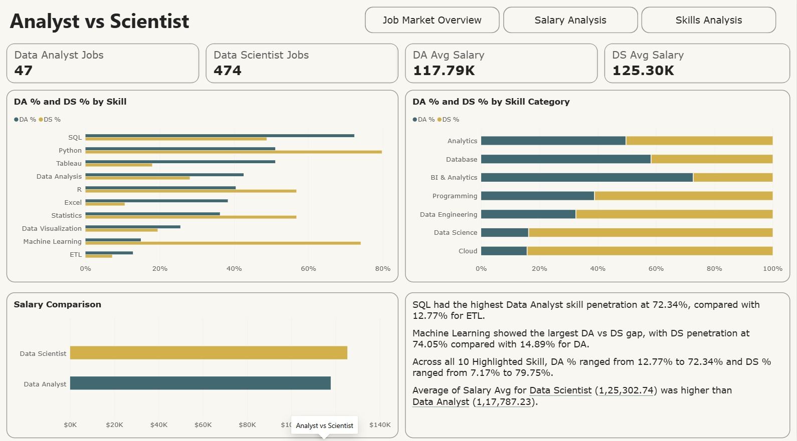

# Data Science & Analytics Job Market Analysis

## Project Overview

This project analyzes a dataset of 672 data-related job postings to understand job demand, salary patterns, skill requirements, and differences between Data Analyst and Data Scientist roles.

The project follows an end-to-end data analytics workflow:

Python → PostgreSQL → SQL → Power BI

The objective was to transform raw job-posting data into meaningful insights that can help understand the skills, salaries, and characteristics associated with different data-related roles.

## Business Questions

* What does the data-related job market look like?
* Which job categories and levels have the highest demand?
* How do salaries vary across job levels, industries, and job categories?
* Which skills are most frequently requested?
* How does skill demand vary across job levels?
* Is there a relationship between skill demand and average salary?
* How do Data Analyst and Data Scientist roles differ in terms of skills and salary?


## Tools & Technologies

| Tool | Purpose |
|---|---|
| Python / Pandas | Data cleaning, transformation and skill extraction |
| PostgreSQL | Data storage and relational data modeling |
| SQL | Data validation and analytical queries |
| Power BI | Interactive dashboards and visualization |
| Jupyter Notebook | Python development and documentation |
| Git / GitHub | Version control and project management |

## Project Workflow

```text
Raw Job Dataset
      │
      ▼
Python Data Cleaning
      │
      ├── Salary Cleaning
      ├── Job Categorization
      ├── Job Level Classification
      ├── Skill Extraction
      └── Skill Categorization
      │
      ▼
PostgreSQL Database
      │
      ├── job_posting
      ├── skills_dim
      └── job_skills
      │
      ▼
SQL Analysis
      │
      ├── Job Market Analysis
      ├── Salary Analysis
      ├── Skill Demand
      ├── Skills by Job Level
      └── Analyst vs Scientist Comparison
      │
      ▼
Power BI Dashboard
```

##  1. Data Cleaning & Preparation

Python and Pandas were used to transform the raw dataset into structured analytical data.

Key data preparation steps

* Removed duplicate records
* Created a unique Job ID
* Cleaned job titles and company information
* Extracted minimum and maximum salary values
* Calculated average salary
* Categorized job titles into standardized job categories
* Classified jobs into Junior, Mid-level and Senior levels
* Extracted technical and analytical skills from job descriptions
* Created skill categories such as:
    * Programming
    * Database
    * BI & Analytics
    * Cloud
    * Data Engineering
    * Data Science
    * Analytics
* Created a normalized job-to-skill relationship

The skill extraction process was implemented using Python and regular expressions to identify relevant skills from job descriptions.

## 2. PostgreSQL Data Model

The cleaned data was loaded into PostgreSQL using a simple relational model.

### Database Structure

### Database Structure

```text

                    job_posting
                    ┌───────────┐
                    │  Job ID   │
                    │ Job Title │
                    │ Salary    │
                    │ Industry  │
                    │ Job Level │
                    └─────┬─────┘
                          │
                          │ 1 : Many
                          ▼
                    job_skills
                    ┌───────────┐
                    │  Job ID   │
                    │ Skill ID  │
                    └─────┬─────┘
                          │
                          │ Many : 1
                          ▼
                    skills_dim
                    ┌──────────────┐
                    │  Skill ID    │
                    │  Skill       │
                    │  Skill Cat.  │
                    └──────────────┘

```

### Tables

### job_posting

Contains one record per job posting, including:

* Job title
* Company
* Location
* Industry
* Sector
* Job level
* Job category
* Salary information

### skills_dim

Contains the unique skills identified in job descriptions and their corresponding skill categories.

### job_skills

A bridge table connecting job postings with their required skills.

This structure allows skills to be analyzed independently while maintaining relationships with individual job postings.

# 3. SQL Analysis

SQL was used to validate the data and answer analytical questions before building the Power BI dashboard.

Examples of analysis performed:

* Total number of job postings
* Number of unique companies
* Job distribution by level
* Job distribution by category
* Job distribution by location
* Average salary by job level
* Average salary by job category
* Average salary by sector
* Most frequently requested skills
* Skills by job level
* Skill demand by role
* Data Analyst vs Data Scientist skill comparison
* Skill penetration percentages by role

A key SQL technique used in the project was window functions to identify the most common skills within each job level.

# 4. Power BI Dashboard

The final Power BI report contains four pages.

⸻

## 1.Job Market Overview

This page provides the overall context before moving into salary and skill analysis.



## 2.Salary Analysis

This page examines how salaries vary across different dimensions.



## 3.Skills Analysis

This page focuses on the technical skills appearing in job postings.



## 4.Analyst vs Scientist

The final page compares Data Analyst and Data Scientist job postings.



### Skill Comparison
Skill penetration was calculated as:
```
Skill % = Jobs requiring the skill
        ───────────────────────────
          Total jobs for the role
```

This highlights how different technical skills are distributed between the two roles within the dataset.

## Key Findings

Based on the analyzed dataset:

1. Data Scientist postings dominate the dataset

The dataset contains significantly more Data Scientist postings than Data Analyst postings:

474 Data Scientist vs 47 Data Analyst postings.

This means comparisons between the two roles should be interpreted in the context of the dataset’s composition.

2. Python is the most frequently identified skill

Python has the highest number of associated job postings among the extracted skills, followed by Machine Learning, Statistics and SQL.

3. SQL is strongly represented in Data Analyst postings

SQL appears in approximately 72.34% of Data Analyst postings, making it one of the strongest differentiating skills for the role within this dataset.

4. Machine Learning is strongly associated with Data Scientist postings

Machine Learning appears in approximately 74.05% of Data Scientist postings, compared with approximately 14.89% of Data Analyst postings.

5. Data Scientist postings have a higher average salary in this dataset

The average salary for Data Scientist postings is approximately $125.30K, compared with $117.79K for Data Analyst postings.

6. Skill demand and salary do not move together uniformly

Some highly demanded skills are associated with relatively high average salaries, while other skills with lower posting counts also appear at similar or higher salary levels.

This suggests that salary is influenced by multiple factors beyond individual skill demand, such as job category, experience level, industry and role requirements.

## What I Learned

This project helped me build an end-to-end understanding of a data analytics workflow, including:

* Cleaning messy real-world datasets using Python
* Using Pandas for data transformation
* Extracting structured information from unstructured job descriptions
* Designing normalized relational tables
* Writing SQL joins, aggregations, CTEs and window functions
* Working with many-to-many relationships
* Building interactive Power BI dashboards
* Creating DAX measures for role and skill comparisons
* Translating analytical results into business-focused visualizations

## Future Improvements

Potential extensions to the project could include:

* Adding more job-posting datasets for a broader market comparison
* Expanding the skill dictionary
* Adding time-based job market analysis if historical data becomes available
* Creating more detailed location-level salary analysis
* Building automated data-refresh pipelines

